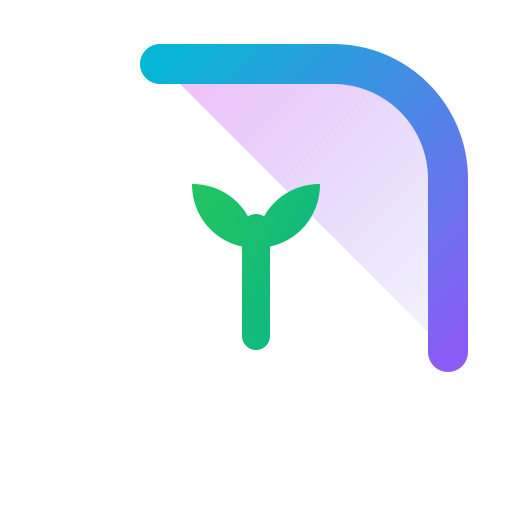

<div align="center">
  
  <h1>HabitNook</h1>
  <p><em>Premium offline-first habit tracker with cloud sync.</em></p>
  
  <h3>✨ <strong><a href="https://habitnook.vercel.app">Live Demo: habitnook.vercel.app</a></strong> ✨</h3>
  
  [](#)
  [](#)
  [](#)
  [](#)
  [](#)
</div>

<hr>

## 🚀 Overview

HabitNook is a beautifully designed, local-first habit tracking application that helps you build and maintain habits with intention. It features a premium, dynamic interface, rich data visualization, offline-first capabilities as a Progressive Web App (PWA), and seamless background synchronization with Supabase.

## ✨ Key Features

- 📱 **Progressive Web App (PWA):** Install HabitNook directly to your home screen on mobile and desktop. It works completely offline with smart asset caching, allowing you to view and log habits without an internet connection.
- ⚡ **Offline-First Architecture:** Your data is immediately saved locally using IndexedDB (Dexie.js), providing zero-latency interactions. Cloud synchronization with Supabase happens quietly in the background when an internet connection is restored.
- 🎨 **Premium Aesthetics:** Crafted with a modern dark-mode color palette, smooth gradients, glassmorphism, and micro-animations for an exceptional user experience.
- 📊 **Advanced Analytics:** Gain deep insights into your progress with rich trend visualization, moving averages, and historical heatmaps.
- 🎯 **Flexible Tracking:** Supports multiple habit frequencies (Daily, Weekly, Monthly) and different target types (Simple Completion or Numeric Targets).

## 🛠 Tech Stack

- **Frontend:** [React](https://reactjs.org/) & [Vite](https://vitejs.dev/)
- **Styling:** [Tailwind CSS](https://tailwindcss.com/)
- **Local Database:** [Dexie.js](https://dexie.org/) (IndexedDB wrapper)
- **Cloud Database & Auth:** [Supabase](https://supabase.com/)
- **PWA Integration:** [vite-plugin-pwa](https://vite-pwa-org.netlify.app/)
- **Icons & Charts:** [Lucide React](https://lucide.dev/) & [Recharts](https://recharts.org/)

## 📦 Installation & Setup

### Prerequisites

- Node.js (v18 or higher recommended)
- npm or pnpm

### Getting Started

1. **Clone the repository:**
   ```bash
   git clone <repository-url>
   cd habbit_tracker
   ```

2. **Install dependencies:**
   ```bash
   npm install
   ```

3. **Configure Environment Variables:**
   Rename `.env.example` to `.env` and add your Supabase credentials:
   ```env
   VITE_SUPABASE_URL=your-supabase-url
   VITE_SUPABASE_ANON_KEY=your-supabase-anon-key
   ```

4. **Start the development server:**
   ```bash
   npm run dev
   ```

5. **Build for production:**
   ```bash
   npm run build
   ```

## 💡 Design Philosophy

HabitNook is built on the principle that habit tracking should feel rewarding and frictionless:
- **Visual Feedback:** Immediate visual confirmation of actions through smooth animations and color state changes.
- **Data Clarity:** Complex data is distilled into easy-to-read sparklines and trend indicators.
- **Frictionless Interaction:** Logging a habit takes as few clicks as possible, with smart defaults based on the current date and frequency.

## 📄 License

This project is licensed under the MIT License.
